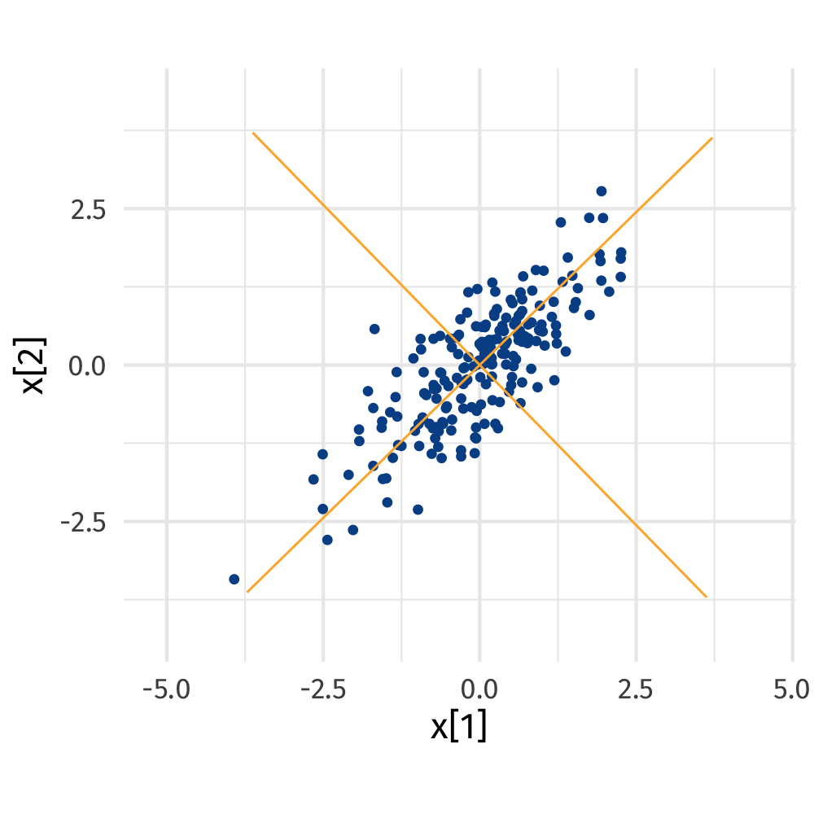

```{r setup, include=FALSE, cache=FALSE}
options(htmltools.dir.version = FALSE)
#knitr::opts_chunk$set(
#  cache = FALSE,
#  dev = 'svg', echo = FALSE, message = FALSE, warning = FALSE,
#  fig.height=6, fig.width = 1.777777*6)

library("mvnfast")
library("vegan")
library("tibble")
library("dplyr")
library("tidyr")
library("ggplot2")
library("gganimate")
library("analogue")
data(varespec, varechem)

## plot defaults
theme_set(theme_minimal(base_size = 16, base_family = "Fira Sans"))
```

# Multivariate data

## Multivariate data

Multivariate != multiple regression

Multivariate means we have two or more *response* variables

We are interested in learning about the common patterns or modes of variation among those multiple response variables

Multivariate data require special statistical methods

## Multivariate data in biology

Community composition &mdash; many species as the responses

In modern biology we have OTUs and ASVs

In chemistry we have metabolites or spectra or masses or &hellip;

All of these constitute multivariate data

## Species composition

Species composition is the set of species in a site or a sample

Typically comes with a measure of abundance

"abundance" could also be whether each species is present or absent in the sample

Relative abundance expresses the abundance of each species as its proportion out of the total abundance in each sample

# Ordinaton

## ordnung

The word "ordination" comes from the German word "ordnung"

## Ordination

Putting things in order is exactly what we do in ordination

* we arrange our samples along gradients by fitting lines and planes through the data that describe the main patterns in those data

* we map data to lower dimensions reflecting how similar the samples are to one another in terms of the variables measured

Three families of models

1. Linear
2. Unimodal
3. Distance-based

## Unconstrained

What is **unconstrained**?

First we look for major variation, then relate it to environmental variation

vs. *constrained* ordination, where we only want to see what can be explained by environmental variables of interest

*How well do we explain the main patterns in the species data*? vs *How large are the patterns we can explain with the measured data*?

## Ordination methods

Principal Components Analysis (PCA) is a linear method &mdash; most useful for environmental data or sometimes with species data and short gradients

Correspondence Analysis (CA) is a unimodal method &mdash; most useful for species data, especially where non-linear responses are observed

Principal Coordinates Analysis (PCO) and Non-metric Multidimensional Scaling (NMDS) &mdash; can be used for any kind of data

## Principal Components Analysis

Instead of doing many regressions, do one with all the responses

No explanatory variables &mdash; uncover latent, underlying gradients

PCA fits a line through our cloud of data in such a way that it maximises the variance in the data captured by that line (i.e.~minimises the distance between the fitted line and the observations)

Fit a second line to form a plane, and so on, until we have one PCA axis for every dimension of the data

Each of these subsequent axes is uncorrelated with previous axes &mdash; they are **orthogonal** &mdash; the variance each axis explains is uncorrelated


# Principal Components Analysis

```{r pca-animation, cache = FALSE, eval = TRUE, echo=FALSE}
## Create Data
set.seed(1)
sig <- matrix(c(1, 0.8, 0.8, 1), byrow = TRUE, ncol = 2)
df <- setNames(as.data.frame(rmvn(200, mu = c(5, 10), sigma = sig)), c("x1", "x2"))
df <- as_tibble(df)

## basic plot
base_plt <- ggplot(df, aes(x = x1, y = x2)) +
    geom_point()

## centre variables and replot
df <- mutate(df,
             x1_c = x1 - mean(x1),
             x2_c = x2 - mean(x2))
base_c_plt <- ggplot(df, aes(x = x1_c, y = x2_c)) +
    geom_point()

## prcomp
pc <- prcomp(df[, c("x1", "x2")])

deg2rad <- function(x) {
    x * pi / 180
}

rad2deg <- function(x) {
    x * 180 / pi
}

R <- function(deg) {
    ang <- deg2rad(deg)
    matrix(c(cos(ang), -sin(ang),
             sin(ang), cos(ang)),
           byrow = TRUE, ncol = 2)
}

rotate <- function(angle, x, y) {
    cbind(x, y) %*% R(angle)
}

project <- function(angle, x, y, axis = 1) {
    x <- max(abs(range(x))) * c(-1,1)
    y <- max(abs(range(y))) * c(-1,1)
    U <- R(angle)
    out <- if (axis == 1) {
        cbind((cbind(x, y) %*% U)[,1, drop = FALSE], 0) %*% t(U)
    } else {
        cbind(0, (cbind(x, rev(y)) %*% U)[,2, drop = FALSE]) %*% t(U)
    }

    out
}

## we want to rotate
rot_angle <- rad2deg(acos(pc$rotation[c(1, 4)]))[2]

## drop first as that is the data
N <- 20
angles <- seq(0, rot_angle, length = N)

rot_data <- lapply(angles, rotate, x = df$x1_c, y = df$x2_c)
pc1_line_data <- lapply(angles, project, x = df$x1_c, y = df$x2_c, axis = 1)
pc2_line_data <- lapply(angles, project, x = df$x1_c, y = df$x2_c, axis = 2)

plt_data <- do.call("rbind", rot_data)
pc1_line_data <- do.call("rbind", pc1_line_data)
pc2_line_data <- do.call("rbind", pc2_line_data)

plt_data <- as.data.frame(plt_data) %>%
    setNames(nm = c("x1", "x2")) %>%
    as_tibble() %>%
    add_column(angle = rep(angles, each = nrow(df)),
               .before = 1)

pc1_line_data <- as.data.frame(pc1_line_data) %>%
    setNames(nm = c("x1", "x2")) %>%
    as_tibble() %>%
    add_column(angle = rep(rev(angles), each = 2),
               .before = 1)

pc2_line_data <- as.data.frame(pc2_line_data) %>%
    setNames(nm = c("x1", "x2")) %>%
    as_tibble() %>%
    add_column(angle = rep(rev(angles), each = 2),
               .before = 1)

ani_plt <- ggplot(plt_data, aes(x = x1, y = x2)) +
    geom_point(colour = "#025196") +
    geom_line(data = pc1_line_data, colour = "#fdb338") +
    geom_line(data = pc2_line_data, colour = "#fdb338") +
    coord_fixed() +
    labs(x = expression(x[1]), y = expression(x[2]))
```

```{r other-pca-plot-stuff, echo=FALSE}
proj_pc1 <- cbind(pc$x[,1], 0) %*% t(pc$rotation)
proj_pc2 <- cbind(0, pc$x[,2]) %*% t(pc$rotation)

project_pcs <- function(x, y, axis = 1, sol) {
    x <- max(abs(range(x))) * c(-1,1)
    y <- max(abs(range(y))) * c(-1,1)
    U <- sol$rotation
    out <- if (axis == 1) {
        cbind((cbind(x, y) %*% U)[,1, drop = FALSE], 0) %*% t(U)
    } else {
        cbind(0, (cbind(x, rev(y)) %*% U)[,2, drop = FALSE]) %*% t(U)
    }

    out
}

rotate_pcs <- function(x, sol) {
    zapsmall(x %*% sol$rotation)
}

proj_pc1 <- with(df, project_pcs(x1_c, x2_c, axis = 1, sol = pc))
proj_pc2 <- with(df, project_pcs(x1_c, x2_c, axis = 2, sol = pc))
rot_pc1  <- with(df, rotate_pcs(proj_pc1, sol = pc))
rot_pc2  <- with(df, rotate_pcs(proj_pc2, sol = pc))

## compute prinicpal component in both coord systems
pcs <- add_column(as_tibble(rbind(proj_pc1, proj_pc2)),
                  pc = rep(1:2, each = 2), .before = 1)
pcs_rot <- as_tibble(rbind(rot_pc1, rot_pc2)) %>%
    setNames(nm = c("x1", "x2")) %>%
    add_column(pc = rep(1:2, each = 2), .before = 1)

## rotate data
df_rot <- as_tibble(pc$x) %>%
    setNames(nm = c("x1_c", "x2_c")) %>%
    mutate(x1_c = -x1_c)

## basic plot
base_plt <- ggplot(df, aes(x = x1, y = x2)) +
    geom_point(size = 1.1)

## centre variables and replot
df <- mutate(df,
             x1_c = x1 - mean(x1),
             x2_c = x2 - mean(x2))
base_c_plt <- ggplot(df, aes(x = x1_c, y = x2_c)) +
    geom_point(size = 1.1)

base_c_pc_plt <- ggplot(df, aes(x = x1_c, y = x2_c)) +
    geom_vline(xintercept = 0, colour = "grey") +
    geom_hline(yintercept = 0, colour = "grey") +
    geom_point(size = 1.1) +
    coord_fixed() +
    geom_line(data = pcs, aes(x = x1, y = x2, group = pc), colour = "#025196")

base_pc_plt <- ggplot(df_rot, aes(x = x1_c, y = x2_c)) +
    geom_point(size = 1.1) +
    coord_fixed() +
    geom_line(data = pcs_rot, aes(x = x1, y = x2, group = pc))
```

## PCA

:::: {.columns}

::: {.column width=33%}

```{r pc-anim-plt1, fig.width = 6, fig.height = 6}
ggplot(df, aes(x = x1_c, y = x2_c)) +
    geom_vline(xintercept = 0, colour = "black", linewidth = 1.5) +
    geom_hline(yintercept = 0, colour = "black", linewidth = 1.5) +
    geom_point(size = 2, colour = "#025196") +
    coord_fixed() +
    labs(title = "Centre variables", x = expression(x[1] - bar(x)[1]),
         y = expression(x[2] - bar(x)[2])) +
    theme_minimal(base_size = 22, base_family = 'Fira Sans')
```

:::

::: {.column width=33%}

```{r pc-anim-plt2, fig.width = 6, fig.height = 6}
ggplot(df, aes(x = x1_c, y = x2_c)) +
    geom_vline(xintercept = 0, colour = "black", linewidth = 1.5) +
    geom_hline(yintercept = 0, colour = "black", linewidth = 1.5) +
    geom_point(size = 2, colour = "#025196") +
    coord_fixed() +
    geom_line(data = pcs, aes(x = x1, y = x2, group = pc), colour = "#fdb338", linewidth = 1.5) +
    labs(title = "Find directions", x = expression(x[1] - bar(x)[1]),
         y = expression(x[2] - bar(x)[2])) +
    theme_minimal(base_size = 22, base_family = 'Fira Sans')
```

:::

::: {.column width=33%}

```{r pc-anim-plt3, fig.width = 6, fig.height = 6}
ggplot(df_rot, aes(x = x1_c, y = x2_c)) +
    geom_point(size = 2, colour = "#025196") +
    coord_fixed() +
    geom_line(data = pcs_rot, aes(x = x1, y = x2, group = pc), colour = "#fdb338", linewidth = 1.5) +
    labs(title = "Rotate", x = "PC1", y = "PC2") +
    theme_minimal(base_size = 22, base_family = 'Fira Sans')
```

:::

::::

## PCA

{fig-align="center"}

## Load vegan

**vegan** is an add-on package

```{r loading-1, eval = FALSE, echo = TRUE}
## install.packages("vegan") # Only need if you've never installed before
library("vegan")
data(varespec)
data(varechem)
```

**vegan** comes with a number of data sets which we'll use to get started

## Vegetation in lichen pastures &mdash; species

```{r loading-2, echo = TRUE}
class(varespec)
dim(varespec)                               # number of samples, species
head(varespec[,1:6], n = 5)
```

`varespec` is a data frame

* *Variables* are the columns (here the species)
* *Observations* are the rows (the samples, sites, etc)

::: {.notes}

Data are cover values of 44 understorey species recorded at 24 locations in lichen pastures within dry *Pinus sylvestris* forests

This arrangement is back-to-front if you are used to OTU like data

:::

## Vegetation in lichen pastures &mdash; chemistry

Also have associated soil physical and chemical measurements at the `r nrow(varespec)` sites

```{r loading-3, echo = TRUE}
head(varechem)
```

::: {.notes}

`Baresoil` is the estimated cover of bare soil
`Humdepth` is the depth of humus layer
:::

## Vegetation in lichen pastures &mdash; PCA

PCA is fitted using `pca()`

* Provide a data frame of observations on one or more variables
* To scale all variables to be &mu; = 0, &sigma;<sup>2</sup> = 1: `scale = TRUE`

```{r vare-pca-1, echo = TRUE}
ord_pc <- pca(decostand(varespec, method = "hellinger"), scale = TRUE)
ord_pc
```

## Vegetation in lichen pastures &mdash; PCA

PCA of the covariance matrix &mdash; default is `scale = FALSE`

```{r vare-pca-1b, echo = TRUE}
pca(decostand(varespec, method = "hellinger"), scale = FALSE)
```

How **vegan** scales the eigenvalues is different to *Canoco*

## Vegetation in lichen pastures &mdash; PCA

```{r vare-pca-1c, echo = TRUE, out.width = "95%", dev.args = list(pointsize = 14)}
biplot(ord_pc, scaling = "symmetric")
```

## PCA biplots

:::: {.columns}

::: {.column width=50%}

* Sample (species) points plotted close together have similar species compositions (occur together)
* In PCA, species scores often drawn as arrows &mdash; point in direction of increasing abundance
* Species arrows with small angles to an axis are highly correlated with that axis

:::

::: {.column width=50%}

```{r vare-pca-2, echo=TRUE, fig.width=6, fig.height=6}
biplot(ord_pc, scaling = "symmetric")
```

:::

::::
 
## Eigenvalues &lambda;

$\lambda$ are the amount of variance (inertia) explained by each axis

:::: {.columns}

::: {.column width=50%}

Extract $\lambda$ using the `eigenvals()` function

```{r vare-pca-3, echo = TRUE}
eigenvals(ord_pc) |> head(4)
```

:::

::: {.column width=50%}

Display $\lambda$ in a **screeplot**

```{r vare-pca-4, echo = TRUE, dev.args = list(pointsize = 14), fig.height = 6, fig.width = 6}
screeplot(ord_pc, bstick = TRUE,
  type = "l", main = NULL)
```

:::

::::

## Eigenvalues &lambda;

The `summary()` method provides additional information

```{r vare-pca-5, echo = TRUE}
summary(eigenvals(ord_pc))
```

# Correspondence Analysis

## Correspondence Analysis

Correspondence analysis (CA) is very similar to PCA &mdash; a weighted form of PCA

The row and column sums are used as weights and this has the effect of turning the analysis into one of relative composition

The weighting is a trick to get linear-based software to fit non-linear responses

These nonlinear response are assumed to unimodal Gaussian curves, all with equal height and tolerance widths, and equally spaced optima

## Correspondence Analysis

```{r}
gaussresp <- function(x,u) { exp(-(x-u)^2/2) }
n_opt <- 20
x <- seq(0, 6, length = 100) ## The gradient
u <- seq(-2, 8, len = n_opt) ## The optima
pack <- outer(x, u, gaussresp)
pack <- as.data.frame(pack) %>%
    setNames(nm = paste0("spp", seq_len(n_opt))) %>%
    as_tibble() %>%
    add_column(x = x, .before = 1) %>%
    pivot_longer(cols = -x, names_to = "species", values_to = "abundance")

ggplot(pack, aes(x = x, y = abundance, colour = species)) +
    geom_line() +
    theme(legend.position = "none") +
    labs(x = "Gradient", y = "Abundance")
```

## Correspondence Analysis

Correspondence analysis (CA) is very similar to PCA &mdash; a weighted form of PCA

The row and column sums are used as weights and this has the effect of turning the analysis into one of relative composition

The weighting is a trick to get linear-based software to fit non-linear responses

These nonlinear response are assumed to unimodal Gaussian curves, all with equal height and tolerance widths, and equally spaced optima

So, not very realistic, but it is surprisingly robust at times to violation of this assumption

## Vegetation in lichen pastures &mdash; CA biplots

:::: {.columns}

::: {.column width=60%}

- Have two sets of scores
    1. Species scores
    2. Site scores
- Sample (species) points plotted close together have similar species compositions (occur together)
- In CA, species scores drawn as points &mdash; this is the fitted optima along the gradients
- Abundance of species declines in concentric circles away from the optima

:::

::: {.column width=40%}
```{r vare-ca-1, echo=TRUE, fig.width=6, fig.height=6, dev.args = list(pointsize = 14)}
ord_ca <- ca(varespec)
plot(ord_ca)
```

:::

:::

## Vegetation in lichen pastures &mdash; CA biplots

- Species scores plotted as weighted averages of site scores, or
- Site scores plotted as weighted averages of species scores, or
- A symmetric plot

```{r vare-ca-2, echo = FALSE, fig.show = "hold", fig.height = 11/2.75, fig.width = 11, dev.args = list(pointsize = 14)}
layout(matrix(1:3, ncol = 3))
plot(ord_ca, scaling = "species", main = "scaling = \"species\"")
plot(ord_ca, scaling = "sites", main = "scaling = \"sites\"")
plot(ord_ca, scaling = "symmetric", main = "scaling = \"symmetric\"")
layout(1)
```

# Co-correspondence analysis

## Co-correspondence analysis

We may be interested in relating two species data sets to one another

Can can't do this using CCA with one data set as the response and the other as the predictors, because this would be too many predictors

We might also not want to treat one data set as the response, we might want to analyse the data symmetrically

Co-correspondence Analysis (Co-CA) is a suitable method

## Co-correspondence analysis

There are two types of Co-CA

1. symmetric Co-CA, and

2. predictive Co-CA

Symmetric Co-CA finds axes in both data sets which maximise the covariation of the two data sets

Predictive Co-CA finds directions in one data set which best predict the response data set

## Symmetric Co-CA

CoCA is provided in the R package *cocorresp*

```{r load-cocorresp-data, echo=TRUE}
library("cocorresp")
data(beetles)
## log transform the beetle data (abundance)
beetles <- log1p(beetles)
data(plants)
```

## Symmetric Co-CA

```{r fit-symcoca, message = TRUE, echo=TRUE}
bp.sym <- coca(beetles ~ ., data = plants, method = "symmetric")
bp.sym
```

## Symmetric Co-CA

```{r, out.width = "80%", fig.align = "center", echo=TRUE}
screeplot(bp.sym)
```

## Symmetric Co-CA

```{r plot-symcoca, fig.show = "hold", out.width = "80%", fig.align = "center", echo=TRUE}
layout(matrix(1:2, ncol = 2))
biplot(bp.sym, which = "y1", main = "Beetles")
biplot(bp.sym, which = "y2", main = "Plants")
layout(1)
```
