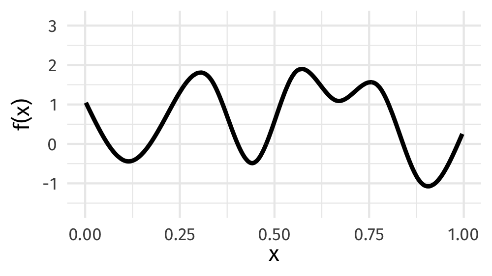
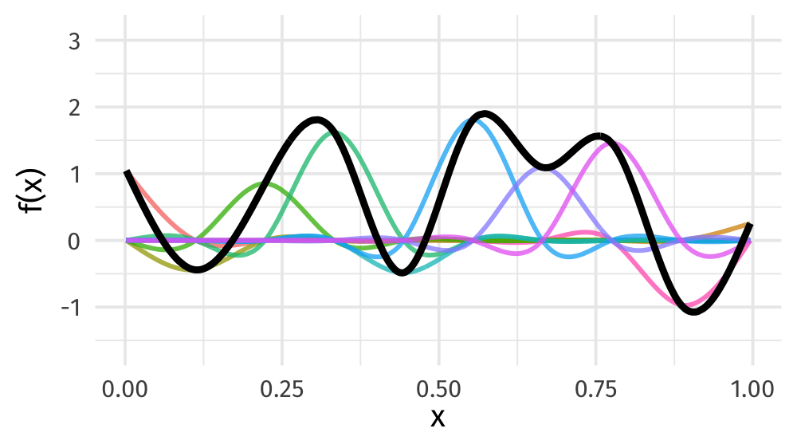
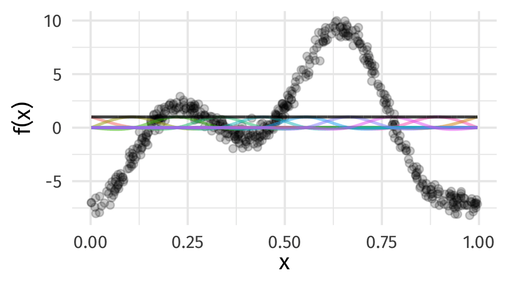
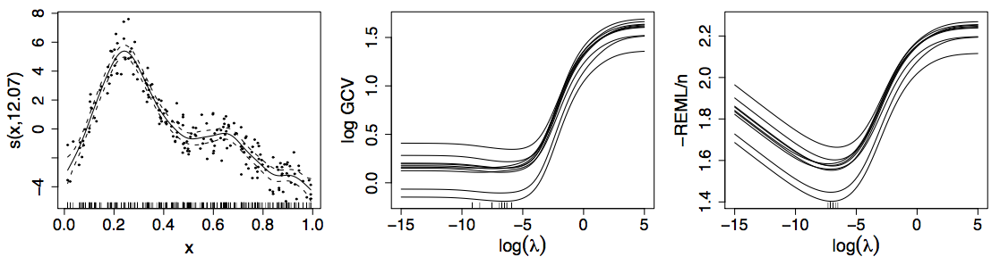
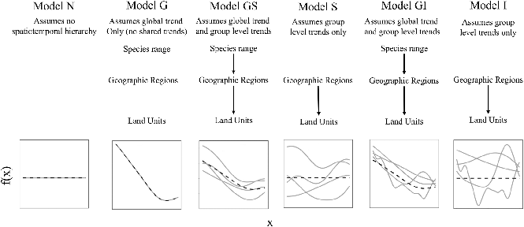

```{r setup, include=FALSE, cache=FALSE}
options(htmltools.dir.version = FALSE)
#knitr::opts_chunk$set(cache = TRUE, dev = "svg", echo = TRUE, message = FALSE,
#  warning = FALSE,
#  fig.height = 6, fig.width = 1.777777 * 6,
#  fig.align = "center")

library('here')
library('mgcv')
library('gratia')
library('ggplot2')
library('purrr')
library('mvnfast')
library("tibble")
library('patchwork')
library('tidyr')
library("knitr")
library("viridis")
library('readr')
library('dplyr')
library('gganimate')
library("ggokabeito")

## plot defaults
theme_set(theme_bw(base_size = 16, base_family = 'Fira Sans'))

## constants
anim_width <- 1000
anim_height <- anim_width / 1.77777777
anim_dev <- "png"
anim_res <- 200
```

# GAMs

# Motivating example

## HadCRUT4 time series

```{r hadcrut-temp-example, echo = FALSE}
URL <- "https://bit.ly/hadcrutv4"
# data are year, median of ensemble runs, certain quantiles in remaining cols
# take only cols 1 and 2
gtemp <- read_table(URL, col_types = 'nnnnnnnnnnnn', col_names = FALSE) |>
  select(num_range('X', 1:2)) |> setNames(nm = c('Year', 'Temperature'))

## Plot
gtemp_plt <- ggplot(gtemp, aes(x = Year, y = Temperature)) +
  geom_line() +
  geom_point() +
  labs(x = "Year", y = expression(Temeprature ~ degree * C))
gtemp_plt
```

::: {.notes}

Hadley Centre NH temperature record ensemble

How would you model the trend in these data?

:::

## (Generalized) Linear Models

$$y_i \sim \mathcal{N}(\mu_i, \sigma^2)$$

$$\mu_i = \beta_0 + \beta_1 \mathtt{year}_{i} + \beta_2 \mathtt{year}^2_{1i} + \cdots + \beta_j \mathtt{year}^j_{i}$$

Assumptions

1. linear effects of covariates are good approximation of the true effects
2. conditional on the values of covariates, $y_i | \mathbf{X} \sim \mathcal{N}(\mu_i, \sigma^2)$
3. this implies all observations have the same *variance*
4. $y_i | \mathbf{X} = \mathbf{x}$ are *independent*

An **additive** model addresses the first of these

# Why bother with anything more complex?

## Is this linear?

```{r hadcrut-temp-example, echo = FALSE}
```

## Polynomials perhaps&hellip;

```{r hadcrut-temp-polynomial, echo = FALSE}
p <- c(1,3,8,15)
N <- 300
newd <- with(gtemp, data.frame(Year = seq(min(Year), max(Year), length = N)))
polyFun <- function(i, data = data) {
    lm(Temperature ~ poly(Year, degree = i), data = data)
}
mods <- lapply(p, polyFun, data = gtemp)
pred <- vapply(mods, predict, numeric(N), newdata = newd)
colnames(pred) <- p
newd <- cbind(newd, pred)
polyDat <- gather(newd, Degree, Fitted, - Year)
polyDat <- mutate(polyDat, Degree = ordered(Degree, levels = p))
gtemp_plt +
  geom_line(data = polyDat,
            mapping = aes(x = Year, y = Fitted, colour = Degree),
            size = 1.5, alpha = 0.9) +
    scale_color_brewer(name = "Degree", palette = "PuOr") +
    theme(legend.position = "right")
```

## Polynomials perhaps&hellip;

We can keep on adding ever more powers of $\boldsymbol{x}$ to the model &mdash; model selection problem

**Runge phenomenon** &mdash; oscillations at the edges of an interval &mdash; means simply moving to higher-order polynomials doesn't always improve accuracy

# GAMs offer a solution

## HadCRUT data set

```{r read-hadcrut, echo = TRUE}
library("readr")
library("dplyr")
URL <-  "https://bit.ly/hadcrutv4"
gtemp <- read_table(
  URL, col_types = "nnnnnnnnnnnn", col_names = FALSE
) |>
  select(num_range("X", 1:2)) |>
  setNames(nm = c("Year", "Temperature"))
```

[File format](https://www.metoffice.gov.uk/hadobs/hadcrut4/data/current/series_format.html)

## HadCRUT data set

```{r show-hadcrut, echo = TRUE}
gtemp
```

## Fitting a GAM

```{r hadcrutemp-fitted-gam, echo = TRUE, results = "hide"}
library("mgcv")
m <- gam(Temperature ~ s(Year), data = gtemp, method = "REML")
summary(m)
```
```{r hadcrutemp-fitted-gam, echo = FALSE}
```

## Fitted GAM

```{r hadcrtemp-plot-gam, echo = FALSE}
N <- 300
newd <- as_tibble(with(gtemp, data.frame(Year = seq(min(Year), max(Year), length = N))))
pred <- as_tibble(as.data.frame(predict(m, newdata = newd, se.fit = TRUE,
                                        unconditional = TRUE)))
pred <- bind_cols(newd, pred) |>
    mutate(upr = fit + 2 * se.fit, lwr = fit - 2 * se.fit)

ggplot(gtemp, aes(x = Year, y = Temperature)) +
    geom_point() +
    geom_ribbon(data = pred,
                mapping = aes(ymin = lwr, ymax = upr, x = Year), alpha = 0.4, inherit.aes = FALSE,
                fill = "#fdb338") +
    geom_line(data = pred,
              mapping = aes(y = fit, x = Year), inherit.aes = FALSE, size = 1, colour = "#025196") +
    labs(x = "Year", y = expression(Temeprature ~ degree*C))
```

# GAMs

## Generalized Additive Models

<br />


Source: [GAMs in R by Noam Ross](https://noamross.github.io/gams-in-r-course/)

::: {.notes}

GAMs are an intermediate-complexity model

* can learn from data without needing to be informed by the user
* remain interpretable because we can visualize the fitted features

:::

## How is a GAM different?

$$\begin{align*}
y_i &\sim \mathcal{D}(\mu_i, \theta) \\ 
\mathbb{E}(y_i) &= \mu_i = g(\eta_i)^{-1}
\end{align*}$$

We model the mean of data as a sum of linear terms:

$$\eta_i = \beta_0 +\sum_j \color{red}{ \beta_j x_{ji}}$$

A GAM is a sum of _smooth functions_ or _smooths_

$$\eta_i = \beta_0 + \sum_j \color{red}{f_j(x_{ji})}$$

## How did `gam()` *know*?

```{r hadcrtemp-plot-gam, echo = FALSE}
```

## What magic is this? {background-color="black" background-image="resources/rob-potter-398564.jpg"}

## {background-color="black" background-image="resources/wiggly-things.png"}

## Fitting a GAM in R

```r
model <- gam(
  y ~ s(x1) + s(x2) + te(x3, x4), # formula describing model
  data = my_data_frame,           # your data
  method = "REML",                # or "ML"
  family = gaussian               # or something more exotic
)
```

`s()` terms are smooths of one or more variables

`te()` terms are the smooth equivalent of *main effects + interactions*

$$\eta_i = \beta_0 + f(\mathtt{Year}_i)$$

```r
library("mgcv")
gam(Temperature ~ s(Year, k = 10), data = gtemp, method = "REML")
```

```{r smooth-fun-animation, results = FALSE, echo = FALSE}
f <- function(x) {
  x^11 * (10 * (1 - x))^6 + ((10 * (10 * x)^3) * (1 - x)^10)
}

draw_beta <- function(n, k, mu = 1, sigma = 1) {
  rmvn(n = n, mu = rep(mu, k), sigma = diag(rep(sigma, k)))
}

weight_basis <- function(bf, x, n = 1, k, ...) {
    beta <- draw_beta(n = n, k = k, ...)
    out <- sweep(bf, 2L, beta, "*")
    colnames(out) <- paste0("f", seq_along(beta))
    out <- as_tibble(out)
    out <- add_column(out, x = x)
    out <- pivot_longer(out, -x, names_to = "bf", values_to = "y")
    out
}

random_bases <- function(bf, x, draws = 10, k, ...) {
    out <- rerun(draws, weight_basis(bf, x = x, k = k, ...))
    # out <- map(seq_len(draws), \(bf, x, k) weight_basis(bf, x = x, k = k))
    out <- bind_rows(out)
    out <- add_column(out, draw = rep(seq_len(draws), each = length(x) * k),
                      .before = 1L)
    class(out) <- c("random_bases", class(out))
    out
}

plot.random_bases <- function(x, facet = FALSE) {
    plt <- ggplot(x, aes(x = x, y = y, colour = bf)) +
        geom_line(lwd = 1, alpha = 0.75) +
        guides(colour = FALSE)
    if (facet) {
        plt + facet_wrap(~ draw)
    }
    plt
}

normalize <- function(x) {
    rx <- range(x)
    z <- (x - rx[1]) / (rx[2] - rx[1])
    z
}

set.seed(1)
N <- 500
data <- tibble(x     = runif(N),
               ytrue = f(x),
               ycent = ytrue - mean(ytrue),
               yobs  = ycent + rnorm(N, sd = 0.5))

k <- 10
knots <- with(data, list(x = seq(min(x), max(x), length = k)))
sm <- smoothCon(s(x, k = k, bs = "cr"), data = data, knots = knots)[[1]]$X
colnames(sm) <- levs <- paste0("f", seq_len(k))
basis <- pivot_longer(cbind(sm, data), -(x:yobs), names_to = "bf")
basis

set.seed(2)
bfuns <- random_bases(sm, data$x, draws = 20, k = k)

smooth <- bfuns |>
    group_by(draw, x) |>
    summarise(spline = sum(y), .groups = "drop") |>
    ungroup()

p1 <- ggplot(smooth) +
    geom_line(data = smooth, aes(x = x, y = spline), lwd = 1.5) +
    labs(y = "f(x)", x = "x") +
    theme_minimal(base_size = 16, base_family = "Fira Sans")

smooth_funs <- animate(
  p1 + transition_states(draw, transition_length = 4, state_length = 2) +
    ease_aes("cubic-in-out"),
  nframes = 200, height = anim_height, width = anim_width, res = anim_res,
  device = anim_dev, units = "px"
)

anim_save("./resources/spline-anim.gif", smooth_funs)
```

## Wiggly things

{fig.align="center"}

::: {.notes}

GAMs use splines to represent the non-linear relationships between covariates, here `x`, and the response variable on the `y` axis.

:::

## Basis expansions

In the polynomial models we used a polynomial basis expansion of $\boldsymbol{x}$

* $\boldsymbol{x}^0 = \boldsymbol{1}$ &mdash; the model constant term
* $\boldsymbol{x}^1 = \boldsymbol{x}$ &mdash; linear term
* $\boldsymbol{x}^2$
* $\boldsymbol{x}^3$
* &hellip;

## Splines

Splines are *functions* composed of simpler functions

Simpler functions are *basis functions* & the set of basis functions is a *basis*

When we model using splines, each basis function $b_k$ has a coefficient $\beta_k$

Resultant spline is a the sum of these weighted basis functions, evaluated at the values of $x$

$$s(x) = \sum_{k = 1}^K \beta_k b_k(x)$$

## Splines formed from basis functions

```{r basis-functions, fig.height=6, fig.width = 1.777777*6, echo = FALSE}
ggplot(basis,
       aes(x = x, y = value, colour = bf)) +
    geom_line(lwd = 2, alpha = 0.5) +
    guides(colour = "none") +
    labs(x = "x", y = "b(x)") +
    theme_minimal(base_size = 20, base_family = "Fira Sans")
```

::: {.notes}

Splines are built up from basis functions

Here I'm showing a cubic regression spline basis with 10 knots/functions

We weight each basis function to get a spline. Here all the basisi functions have the same weight so they would fit a horizontal line

:::

## Weight basis functions &#8680; spline

```{r basis-function-animation, results = 'hide', echo = FALSE}
bfun_plt <- plot(bfuns) +
    geom_line(data = smooth, aes(x = x, y = spline),
              inherit.aes = FALSE, lwd = 1.5) +
    labs(x = "x", y = "f(x)") +
    theme_minimal(base_size = 14, base_family = "Fira Sans")

bfun_anim <- animate(
    bfun_plt + transition_states(draw, transition_length = 4, state_length = 2) + 
    ease_aes("cubic-in-out"),
    nframes = 200, height = anim_height, width = anim_width, res = anim_res,
    dev = anim_dev, units = "px"
)

anim_save(here("02-gams/resources/basis-fun-anim.gif"), bfun_anim)
```

{fig.align="center"}

::: {.notes}

But if we choose different weights we get more wiggly spline

Each of the splines I showed you earlier are all generated from the same basis functions but using different weights

:::

## How do GAMs learn from data?

```{r example-data-figure, fig.height=6, fig.width = 1.777777*6, echo = FALSE}
data_plt <- ggplot(data, aes(x = x, y = ycent)) +
  geom_line(col = "goldenrod", lwd = 2) +
  geom_point(aes(y = yobs), alpha = 0.2, size = 3) +
  labs(x = "x", y = "f(x)") +
  theme_minimal(base_size = 20, base_family = "Fira Sans")
data_plt
```

::: {.notes}

How does this help us learn from data?

Here I'm showing a simulated data set, where the data are drawn from the orange functions, with noise. We want to learn the orange function from the data

:::

## Maximise penalised log-likelihood &#8680; &beta;

```{r basis-functions-anim, results = "hide", echo = FALSE}
sm2 <- smoothCon(s(x, k = k, bs = "cr"), data = data, knots = knots)[[1]]$X
beta <- coef(lm(ycent ~ sm2 - 1, data = data))
wtbasis <- sweep(sm2, 2L, beta, FUN = "*")
colnames(wtbasis) <- colnames(sm2) <- paste0("F", seq_len(k))
## create stacked unweighted and weighted basis
basis <- as_tibble(rbind(sm2, wtbasis)) |>
  add_column(
    x = rep(data$x, times = 2),
    type = rep(c("unweighted", "weighted"), each = nrow(sm2)),
    .before = 1L
  )

wtbasis <- as_tibble(rbind(sm2, wtbasis)) %>%
  add_column(
    x = rep(data$x, times = 2),
    fitted = rowSums(.),
    type   = rep(c("unweighted", "weighted"), each = nrow(sm2))
  ) |>
  pivot_longer(-(x:type), names_to = "bf")

basis <- pivot_longer(basis, -(x:type), names_to = "bf")

p3 <- ggplot(data, aes(x = x, y = ycent)) +
  geom_point(aes(y = yobs), alpha = 0.2) +
  geom_line(
    data = basis,
    mapping = aes(x = x, y = value, colour = bf),
    lwd = 1, alpha = 0.5
  ) +
  geom_line(
    data = wtbasis,
    mapping = aes(x = x, y = fitted),
    lwd = 1, colour = "black", alpha = 0.75
  ) +
  guides(colour = FALSE) +
  labs(y = "f(x)", x = "x") +
  theme_minimal(base_size = 16, base_family = "Fira Sans")

crs_fit <- animate(p3 +
    transition_states(type, transition_length = 4, state_length = 2) +
    ease_aes("cubic-in-out"),
nframes = 100,
height = anim_height,
width = anim_width,
res = anim_res,
dev = anim_dev,
units = "px"
)

anim_save(here("02-gams/resources/gam-crs-animation.gif"), crs_fit)
```

{fig.align="center"}

::: {.notes}

Fitting a GAM involves finding the weights for the basis functions that produce a spline that fits the data best, subject to some constraints

:::

## The whole process 1

```{r whole-basis-proces, echo = FALSE, fig.height = 4, fig.width = 1.777777 * 6}
K <- 13
df <- data.frame(x = seq(0, 1, length = 200))
knots <- data.frame(x = seq(0, 1, length.out = 11))
bs <- basis(s(x, bs = "ps", k = K), data = df,
    knots = list(x = seq(-3, 13) / 10))

# let's weight the basis functions (simulating model coefs)
set.seed(1)
betas <- data.frame(.bf = factor(seq_len(K)), beta = rnorm(K))

unwtd_bs_plt <- bs |>
    draw() +
    geom_vline(aes(xintercept = x), data = knots, linetype = "dotted",
        alpha = 0.5)

# we need to merge the weights for each basis function with the basis object
bs <- bs |>
    left_join(betas, by = join_by(".bf" == ".bf")) |>
    mutate(value_w = .value * beta)

# weighted basis
wtd_bs_plt <- bs |>
    ggplot(aes(x = x, y = value_w, colour = .bf, group = .bf)) +
    geom_line(show.legend = FALSE) +
    geom_vline(aes(xintercept = x), data = knots, linetype = "dotted",
        alpha = 0.5) +
    labs(y = expression(f(x)), x = "x")

# now we want to sum the weighted basis functions for each value of `x`
spl <- bs |>
    group_by(x) |>
    summarise(spline = sum(value_w))

take <- c(83, 115)
pts <- bs |>
    group_by(.bf) |>
    slice(take)

# now plot
bs_plt <- bs |>
    ggplot(aes(x = x, y = value_w, colour = .bf, group = .bf)) +
    geom_line(show.legend = FALSE) +
    geom_line(aes(x = x, y = spline), data = spl, linewidth = 1.25,
              inherit.aes = FALSE) +
    geom_vline(aes(xintercept = x), data = knots, linetype = "dotted",
        alpha = 0.5) +
    geom_vline(xintercept = c(df$x[take]), linetype = "dashed",
        alpha = 1) +
    geom_point(data = pts, aes(x = x, y = value_w, colour = .bf, group = .bf),
        size = 2, show.legend = FALSE) +
    geom_point(data = slice(spl, take), aes(x = x, y = spline),
        size = 3, colour = "red", inherit.aes = FALSE) +
    labs(y = expression(f(x)), x = "x")

unwtd_bs_plt + wtd_bs_plt + bs_plt + plot_layout(ncol = 3)
```

## The whole process 2

```{r whole-basis-proces-2-model}
dat <- data_sim("eg1", seed = 4)
m <- gam(y ~ s(x0) + s(x1) + s(x2, bs = "bs") + s(x3),
         data = dat, method = "REML")
```

```{r whole-basis-proces-2-model-draw, fig.height = 5, fig.width = 1.777777 * 6}
draw(m) + plot_layout(nrow = 1, ncol = 4)
```

## The whole process 3

```{r whole-basis-proces-2, echo = FALSE, fig.height = 6, fig.width = 1.777777 * 6}
# data to evaluate the basis at
# using the CRAN version of {gratia}, we need `m`
ds <- data_slice(m, x2 = evenly(x2, n = 200))
# from 0.9.0 (or current GitHub version) you can do
# ds <- data_slice(dat, x2 = evenly(x2, n = 200))

# generate a tidy representation of the fitted basis functions
x2_bs <- basis(m, term = "s(x2)", data = ds)

# compute values of the spline by summing basis functions at each x2
x2_spl <- x2_bs |>
    group_by(x2) |>
    summarise(spline = sum(.value))

# evaluate the spline at the same values as we evaluated the basis functions
x2_sm <- smooth_estimates(m, "s(x2)", data = ds) |>
    add_confint()

take <- c(65, 175)
pts <- x2_bs |>
    group_by(.bf) |>
    slice(take)

# now plot
x2_bs |>
    ggplot(aes(x = x2, y = .value, colour = .bf, group = .bf)) +
    geom_line(show.legend = FALSE) +
    geom_ribbon(aes(x = x2, ymin = .lower_ci, ymax = .upper_ci),
                data = x2_sm,
                inherit.aes = FALSE, alpha = 0.2) +
    geom_line(aes(x = x2, y = .estimate), data = x2_sm,
              linewidth = 1.5, inherit.aes = FALSE) +
    geom_vline(xintercept = c(ds$x2[take]), linetype = "dashed",
        alpha = 1) +
    geom_point(data = pts, aes(x = x2, y = .value, colour = .bf, group = .bf),
        size = 2, show.legend = FALSE) +
    geom_point(data = slice(x2_sm, take), aes(x = x2, y = .estimate),
        size = 3, colour = "red", inherit.aes = FALSE) +
    labs(y = expression(f(x2)), x = "x2")
```

# Avoid overfitting our sample

## How wiggly?

$$
\int_{\mathbb{R}} [f^{\prime\prime}]^2 dx = \boldsymbol{\beta}^{\mathsf{T}}\mathbf{S}\boldsymbol{\beta}
$$

## Penalised fit

$$
\mathcal{L}_p(\boldsymbol{\beta}) = \mathcal{L}(\boldsymbol{\beta}) - \frac{1}{2} \lambda\boldsymbol{\beta}^{\mathsf{T}}\mathbf{S}\boldsymbol{\beta}
$$

## Wiggliness

$$\int_{\mathbb{R}} [f^{\prime\prime}]^2 dx = \boldsymbol{\beta}^{\mathsf{T}}\mathbf{S}\boldsymbol{\beta} = \large{W}$$

(Wiggliness is 100% the right mathy word)

We penalize wiggliness to avoid overfitting

## Making wiggliness matter

$W$ measures **wiggliness**

(log) likelihood measures closeness to the data

We use a **smoothing parameter** $\lambda$ to define the trade-off, to find
the spline coefficients $B_k$ that maximize the **penalized** log-likelihood

$$\mathcal{L}_p = \log(\text{Likelihood})  - \lambda W$$

## HadCRUT4 time series

```{r hadcrut-temp-penalty, echo = FALSE}
K <- 40
lambda <- c(10000, 1, 0.01, 0.00001)
N <- 300
newd <- with(gtemp, data.frame(Year = seq(min(Year), max(Year), length = N)))
fits <- lapply(lambda, function(lambda) gam(Temperature ~ s(Year, k = K, sp = lambda), data = gtemp))
pred <- vapply(fits, predict, numeric(N), newdata = newd)
op <- options(scipen = 100)
colnames(pred) <- lambda
newd <- cbind(newd, pred)
lambdaDat <- gather(newd, Lambda, Fitted, - Year)
lambdaDat <- transform(lambdaDat, Lambda = factor(paste("lambda ==", as.character(Lambda)),
                                                  levels = paste("lambda ==", as.character(lambda))))

gtemp_plt + geom_line(data = lambdaDat, mapping = aes(x = Year, y = Fitted, group = Lambda),
                      size = 1, colour = "#e66101") +
    facet_wrap( ~ Lambda, ncol = 2, labeller = label_parsed)
options(op)
```

## Picking the right wiggliness

:::: {.columns}

::: {.column width=50%}
Ways to think about optimizing $\lambda$:

* Predictive: Minimize out-of-sample error
* Bayesian:  Put priors on our basis coefficients

:::

::: {.column width=50%}

Many methods: AIC, Mallow's $C_p$, GCV, ML, REML, NCV

* **Practically**, use **REML** or **ML** for numerical stability
* .small[`gam(..., method = "REML")`] 
* Source: Wood (2011)

:::

::::

## Picking the right wiggliness

{fig.align="center"}

## Maximum allowed wiggliness

We set **basis complexity** or "size" $k$

This is _maximum wigglyness_, can be thought of as number of small functions that make up a curve

Once smoothing is applied, curves have fewer **effective degrees of freedom (EDF)**

$\text{EDF} < k$

## Maximum allowed wiggliness

$k$ must be *large enough*, the $\lambda$ penalty does the rest

*Large enough* &mdash; space of functions representable by the basis includes the true function or a close approximation to the true function

Bigger $k$ increases computational cost

In **mgcv**, default $k$ values are arbitrary &mdash; after choosing the model terms, this is the key user choice

**Must be checked!** &mdash; `k.check()`

## GAM summary so far

1. GAMs give us a framework to model flexible nonlinear relationships

2. Use little functions (**basis functions**) to make big functions (**smooths**)

3. Use a **penalty** to trade off wiggliness/generality 

4. Need to make sure your smooths are **wiggly enough**

# gratia 📦

## gratia 📦

{gratia} is a package for working with GAMs

Mostly limited to GAMs fitted with {mgcv} & {gamm4}

Follows (sort of) Tidyverse principles

* return tibbles (data frames)

* suitable for plotting with {ggplot2}

* graphics use {ggplot2} and {patchwork}

## `draw()`

The main function is `draw()`

Has methods for many of the function outputs in {gratia} and for models

## Plotting smooths

```{r draw-mcycle, out.width = "90%", fig.align = "center"}
data(mcycle, package = "MASS")
m <- gam(accel ~ s(times), data = mcycle, method = "REML")
draw(m)
```

## Plotting smooths

```{r draw-four-fun-sim, fig.show = "hide"}
df <- data_sim("eg1", n = 1000, seed = 42)
df
m_sim <- gam(y ~ s(x0) + s(x1) + s(x2) + s(x3),
             data = df, method = "REML")
draw(m_sim)
```

## Plotting smooths

```{r draw-four-fun-sim-plot, echo = FALSE, out.width = "95%"}
draw(m_sim)
```

## Plotting smooths

```{r draw-mcycle-options, fig.show = "hide"}
draw(m_sim,
     residuals = TRUE,           # add partial residuals
     overall_uncertainty = TRUE, # include uncertainty due to constant
     unconditional = TRUE,       # correct for smoothness selection
     rug = FALSE)                # turn off rug plot
```

## Plotting smooths


```{r draw-mcycle-options-plot, out.width = "95%", echo = FALSE}
draw(m_sim, residuals = TRUE, overall_uncertainty = TRUE,
     unconditional = TRUE, rug = FALSE)
```

# Exercise 1

# HGAMs

## Hierarchical models

The general term encompassing

* Random effects
* Mixed effects
* Mixed models
* &hellip;

Models are *hierarchical* because we have effects on the response at different scales

Data are grouped in some way

## Hierarchical GAMs

Hierarchical GAMs or HGAMs are what we (Pedersen et al 2019 *PeerJ*) called the marriage of

1. Hierarchical GLMs (aka GLMMs, aka Hierarchical models)
2. GAMs

Call them HGAMs if you want but these are really just *hierarchical models*

There's nothing special HGAMs once we've created the basis functions

## Hierarchical GAMs

Pedersen et al (2019) *PeerJ* described 6 models

```{r, fig.align = "center", out.width = "95%", echo = FALSE}

```

Source: [Lawton *et al* (2022) *Ecography*](http://doi.org/10.1111/ecog.05763) modified from [Pedersen *et al* (2019) *PeerJ*](http://doi.org/10.7717/peerj.6876)

## Global effects

What we called *global effects* or *global trends* are a bit like population-level effects in mixed-model speak

They aren't quite, but they are pretty close to the average smooth effect over all the data

Really these are *group-level effects* or *group-level effects* where data has multiple levels

1. "population", top level grouping (i.e. everything)
2. treatment level,
3. etc

## Subject-specific effects

Within these groups we have *subject-specific effects* &mdash; which could be smooth

Repeated observations on a set of subjects over time say

Those subjects may be within groups (treatment groups say)

We may or may not have group-level (*global*; treatment) effects

## Hierarchical GAMs

These models are just different ways to decompose the data

If there are common (non-linear) effects that explain variation for all subjects in a group it may be more parsimonious to

* model those common effects plus subject-specific differences, instead of

* modelling each subject-specific response individually

# Distributional models

## Distributional models

So far we have modelled the mean or $\mathbb{E}(\boldsymbol{y})$

We either assumed the variance was constant (Gaussian) or followed a prescribed form implied by the family / random component used (GLMs / GAMs)

What if the data don't follow these assumptions?

. . .

We could model all the parameters of the distribution

## Parameters beyond the mean

```{r gaussian-distributions-plt, echo = FALSE}
x <- seq(8, -8, length = 500)
df <- data.frame(density = c(dnorm(x, 0, 1), dnorm(x, 0, 2), dnorm(x, 2, 1), dnorm(x, -2, 1)),
                 x = rep(x, 4),
                 distribution = factor(rep(c("mean = 0; var = 1", "mean = 0; var = 4",
                                             "mean = 2; var = 1", "mean = -2; var = 1"), each = 500),
                                       levels = c("mean = 0; var = 1", "mean = 0; var = 4",
                                                  "mean = 2; var = 1", "mean = -2; var = 1")))
plt1 <- ggplot(subset(df, distribution %in% c("mean = 0; var = 1", "mean = 0; var = 4")),
               aes(x = x, y = density, colour = distribution)) +
    geom_line(size = 1) + theme(legend.position = "top") +
    guides(col = guide_legend(title = "Distribution", nrow = 2, title.position = "left")) +
    labs(x = "x", y = "Probability density")

plt2 <- ggplot(subset(df, distribution %in% c("mean = 2; var = 1", "mean = -2; var = 1")),
               aes(x = x, y = density, colour = distribution)) +
    geom_line(size = 1) + theme(legend.position = "top") +
    guides(col = guide_legend(title = "Distribution", nrow = 2, title.position = "left")) +
    labs(x = "x", y = "Probability density")

plt <- plt1 + plt2
plt
```

::: {.notes}

To do this we'll need models for the variance of a data set

If we think of the Gaussian distribution that distribution has two parameters, the mean and the variance

In linear regression we model the mean of the response at different values of the covariates, and assume the variance is constant at a value estimated from the residuals

In the left panel I'm showing how the Gaussian distribution changes as we alter the mean while keeping the variance fixed, while in the right panel I keep the mean fixed but vary the variance &mdash; the parameters are independent

:::

## Distributional models

$$y_{i} | \boldsymbol{x}_i \sim \mathcal{D}(\vartheta_{1}(\boldsymbol{x}_i), \ldots, \vartheta_{K}(\boldsymbol{x}_i))$$

For the Gaussian distribution

* $\vartheta_{1}(\boldsymbol{x}_i) = \mu(\boldsymbol{x}_i)$

* $\vartheta_{2}(\boldsymbol{x}_i) = \sigma(\boldsymbol{x}_i)$

::: {.notes}

Instead of treating the variance as a nuisance parameter, we could model both the variance **and** the mean as functions of the covariates

This is done using what is called a *distributional model*

In this model we say that the response values y_i, given the values of one or more covariates x_i follow some distribution with parameters theta, which are themselves functions of one or more covariates

For the Gaussian distribution theta 1 would be the mean and theta 2 the variance (or standard deviation)

We do not need to restrict ourselves to the Gaussian distribution however

:::

## Pseudonyms

These models in GAM form were originally termed GAMLSS

GAMs for *L*ocation *S*cale *S*hape ([Rigby & Stasinopoulos, 2005](http://doi.org/10.1111/j.1467-9876.2005.00510.x)) in the {gamlss} 📦

But the name *Distributional* model is more general

## Distributional models

In {mgcv} 📦 special `family` functions are provided for some distributions which allow all parameters of the distribution to be modelled

:::: {.columns}

::: {.column width=40%}
* `gaulss()` Gaussian
* `ziplss()` ZI Poisson
* `twlss()` Tweedie
* `gevlss()` GEV

:::

::: {.column width=60%}
* `gamals()` Gamma
* `shash()` 4 parameter Sinh-arcsinh
* `gumbls()` Gumble
:::

::::

## Distributional models

Provide a list of formulas, 1 per linear predictor

```{r eval = FALSE}
gam(list(accel ~ s(times, k = 20, bs = "ad"),
               ~ s(times, k = 10)),
         data = mcycle,
         method = "REML", # <== IIRC REML is only option for these LSS
         family = gaulss())
```

And you need to really understand how these models are parameterised internally and what they are actually fitting and returning

. . .

**Read the relevant manual page**

# Exercise 2
