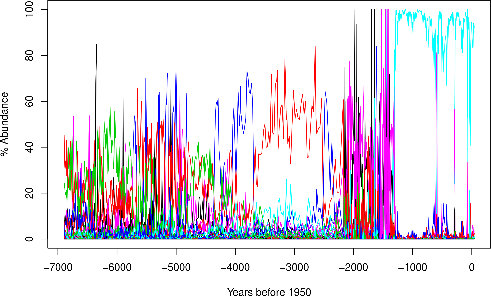
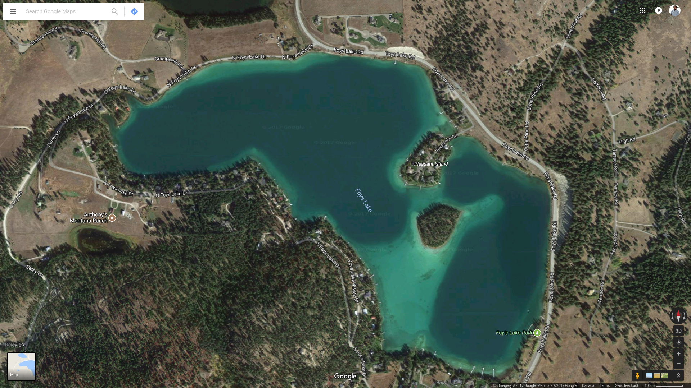
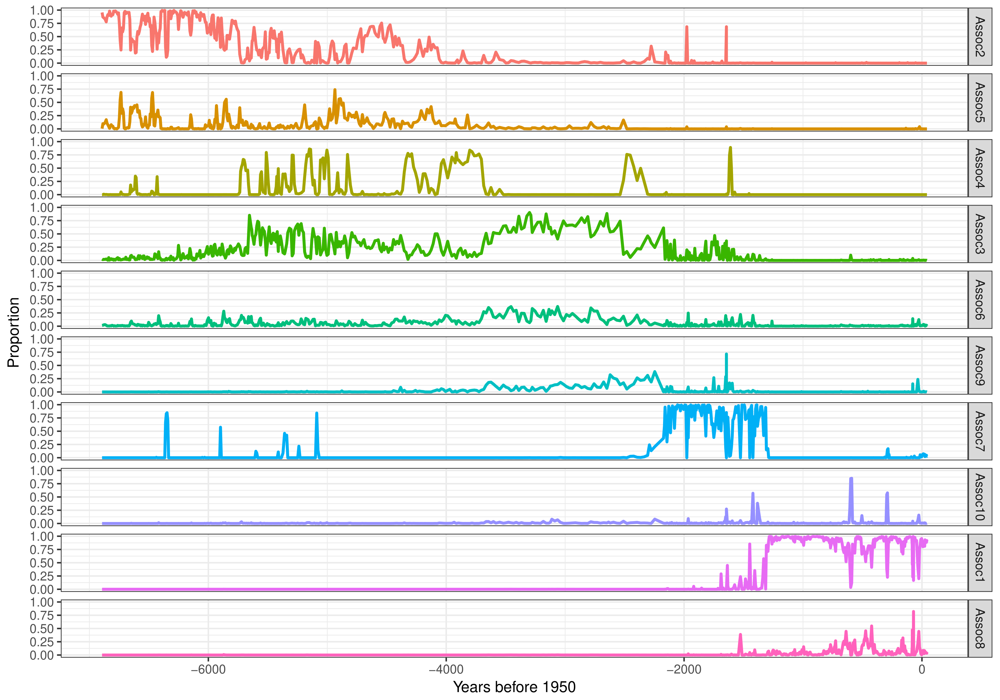
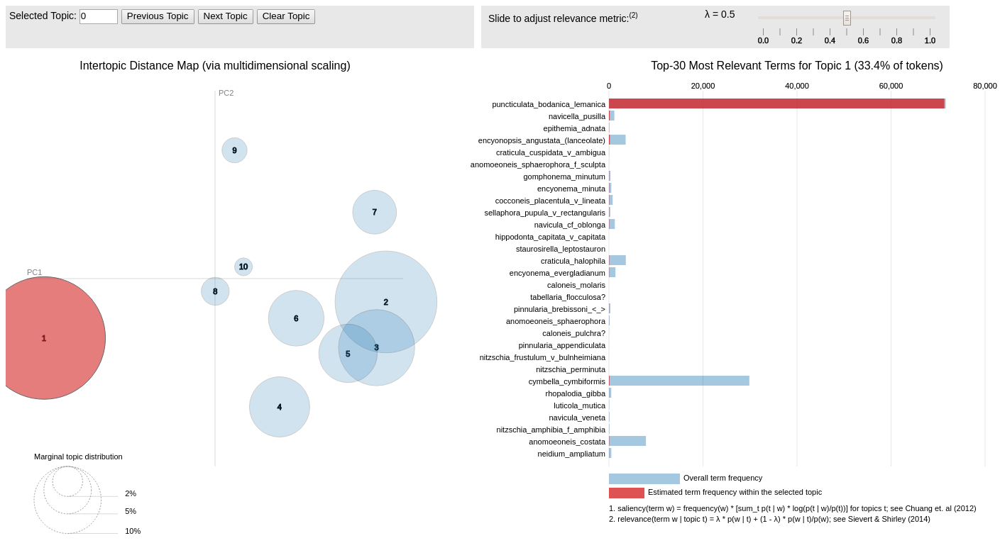
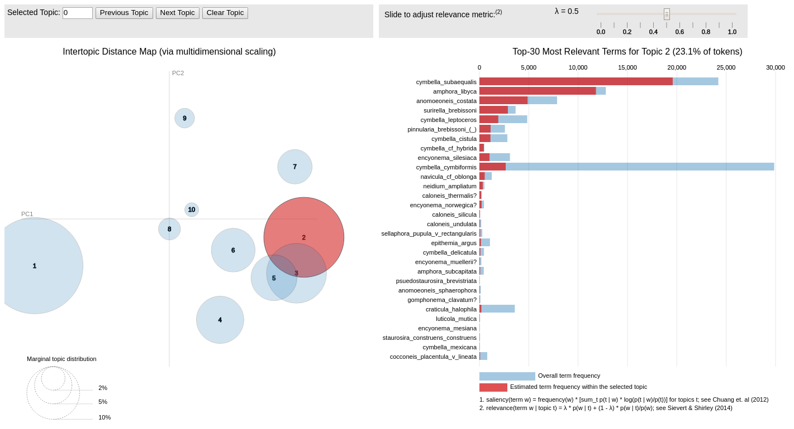
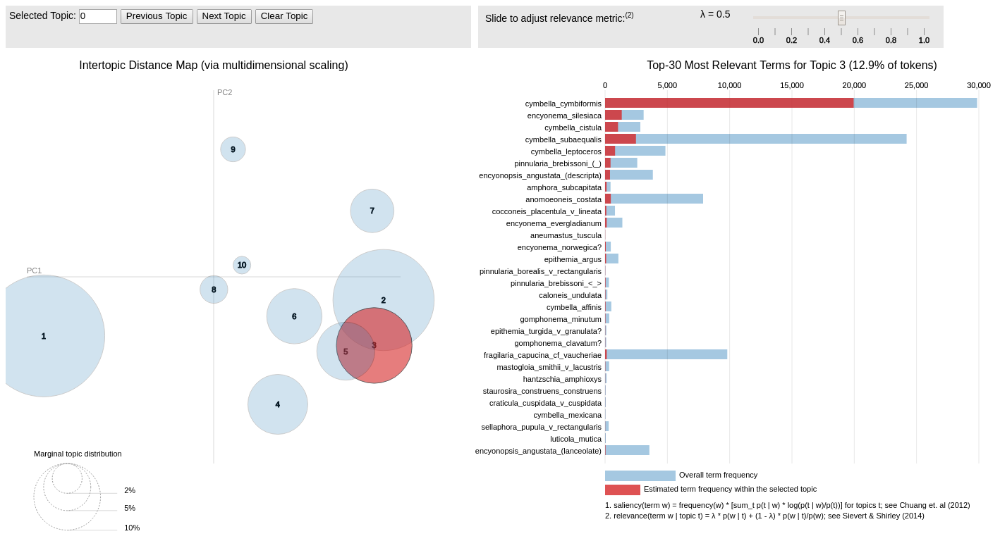
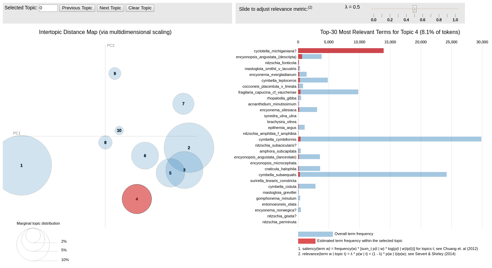
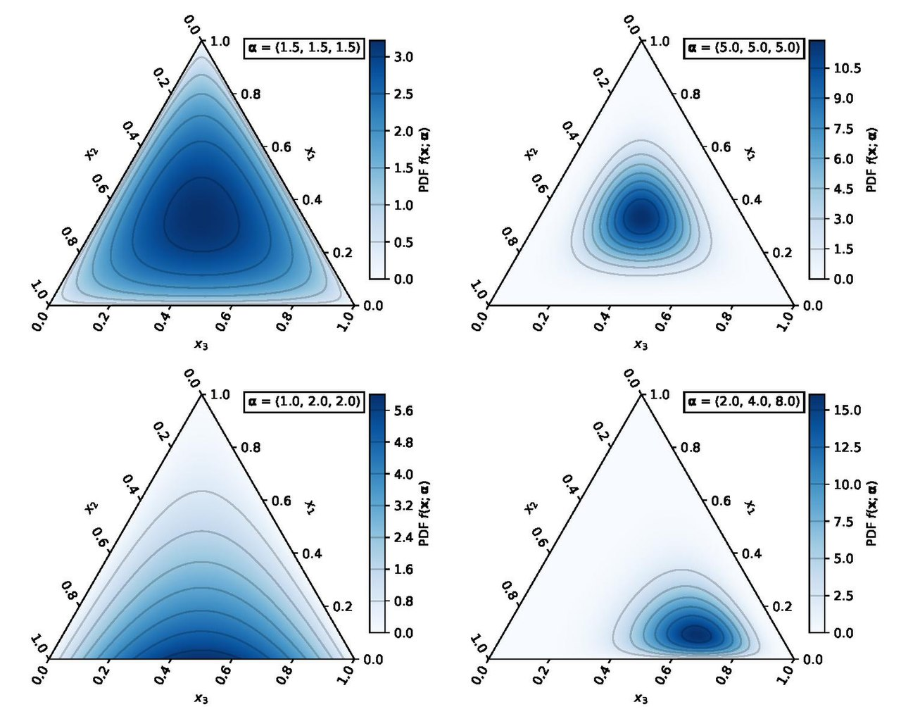
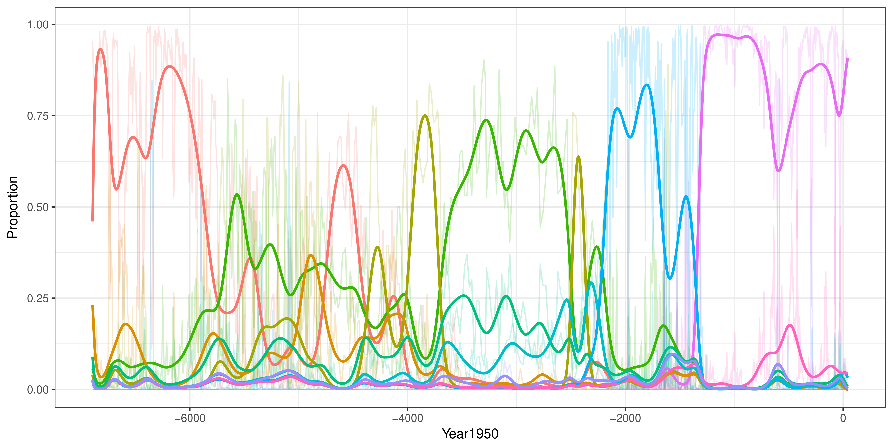

```{r setup, include=FALSE, cache=FALSE}
options(htmltools.dir.version = FALSE)
#knitr::opts_chunk$set(cache = TRUE, dev = "svg", echo = TRUE, message = FALSE,
#  warning = FALSE,
#  fig.height = 6, fig.width = 1.777777 * 6,
#  fig.align = "center")

library("ggplot2")
library("dplyr")
library("mgcv")
library("gratia")
library("readr")

library("readxl")
library("here")
library("pangaear")
library("janitor")
library("topicmodels")
library("analogue")
library("brms")
library("copula")
library("GJRM")
library("tibble")
library("ggtext")

## plot defaults
theme_set(theme_minimal(base_size = 14, base_family = "Fira Sans"))

## constants
anim_width <- 1000
anim_height <- anim_width / 1.77777777
anim_dev <- "png"
anim_res <- 200
```

## Statistical thinking & palaeo

Palaeo data are challenging

Important to grapple with these "problems"

Approaching data from the point of view of modelling process in our systems statistically

Estimate quantities of interest & quantify their uncertainty

::: {.notes}

We all know palaeo data are challenging to analyse, for a whole host of reasons & they don't play well with formal statistical time series methods

However, it is important to grapple with these problems and address them statistically

When I talk about statistical thinking and applying it to palaeo data, I'm thinking about having researchers approach the data from the view point of modelling them statistically, and using statistical models to estimate quantities of interest from a statistical model

:::

# Multivariate data {background-gradient="linear-gradient(to bottom, #283b95, #17b2c3)"}

## Tradition

* Typically proportional composition

* Dimension reductions via ordination

* Clustering

* Dissimilarity

* Approximations

## Maslow's hammer {background-color="black" background-image="resources/anne-nygard-yYRAvcPrWms-unsplash.jpg"}

source: Anne Nygard

## It's OK to follow tradition

The traditional methods haven't stopped working

. . .

But at some point they may hold us back

# Topic models {background-gradient="linear-gradient(to bottom, #283b95, #17b2c3)"}

## Complex multivariate species data

{fig-align="center" width="85%"}

Data provided by Jeffery Stone (Indiana State University)

## Dimension reduction

Typically we can't model all 100+ taxa in data sets like this

- (M)ARSS-like models don't like the large $n$

Seek a reduced dimensionality of the data that preserves the signal

Existing dimension reduction methods aren't appropriate for questions we want to ask

- Interpretation of latent factors is complex (PCA, CA, Principal Curves)
- Linear combination of all taxa

Can we group species into $J$ *associations* and soft cluster samples as compositions of these associations?

Twinspan?

## Foy Lake --- Montana

{fig-align="centre" width="100%"}

## Foy Lake --- Montana

{fig-align="center" width="100%"}

## Topic models

Machine learning approach for organizing text documents

- **Latent Dirichlet Allocation (LDA)** ---  (Blei, Ng, & Jordan, *J. Mach. Learn. Res.* 2003)

*Generative* model for word occurences in documents

- Valle, Baiser, Woodall, & Chazdon, R. (2014) *Ecology Letters* **17**

- Christensen, Harris, & Ernest. (2018) *Ecology* doi:10.1002/ecy.2373

## Community of Skittles

{fig-align="center" width="75%"}

## Individual skittles from one of four flavoured packs

{fig-align="center" width="65%"}

What are the proportion of flavours in each pack?

How many of each pack comprise the skittle community?

## Latent Dirichlet Allocation

Aim is to infer the 

- distribution of skittle **flavours** within each pack $\beta_j$, and
- distribution of skittle **packs** within each community (*sample*)

Achieve a soft clustering of samples --- mixed membership model

Achieve a soft clustering of **species** (flavours) into **associations** of taxa (packs)

User supplies $J$ --- the number of associations *a priori* --- $j = \{1, 2, \dots, J\}$

$J$ can be chosen using AIC, *perplexity*, CV, held-out likelihood, ...

## Intuition behind LDA

Latent Dirichlet Allocation represents a trade-off between two goals

1. for each sample, allocate its individuals to a **few associations of species**
2. in each association, assign high probability to a **few species**

## Intuition behind LDA

These are in opposition

* assigning a sample to a single association makes goal *2* **hard** --- all its species must have high probability under that one topic
* putting very few species in each association makes goal *1* **hard** --- to cover all individuals in a sample must assign sample to many associations

Trading off these two goals therefore results in LDA finding tightly co-occurring species

## Latent Dirichlet Allocation

1. Flavour distribution for $j$th type of Skittle $\beta_j \sim \text{Dirichlet}(\delta)$

2. Proportions of each type in the Skittle community $\theta \sim \text{Dirichlet}(\alpha)$

3. For each skittle $s_i$

    - Choose a pack in proportion
    
        $$z_i \sim \text{Multinomial}(\theta)$$

    - Choose a flavour from chosen pack with probability
    
        $$p(s_i | z_i, \beta_j) \sim \text{Multinomial}(\delta)$$

## Correlated Topic Model

LDA assumes associations of species are **uncorrelated**

Potentially more *parsimonious* & *realistic* if associations were correlated

Proportions of each type in the Skittle community --- draw

$$\eta_j \sim N(\mu, \Sigma)$$
	
Then transform $\eta_J$ to proportional scale

$\Sigma$ controls the correlation between *associations*

Blei & Lafferty (2007) *Ann. Appl. Stat.* **1**, 17&ndash;35.

## Correlated Topic Model

{fig-align="center" width="80%"}

## Topic Model ➠ Dimension reduction

::: {layout-ncol=2}


:::

## Displaying results

Traditionally large corpus --- *interactive* exploration of results

- plot topic proportions over time

- ordinatate topic proportions

    - PCA~Hellinger~, CA, etc

## Latent Dirichlet Allocation --- Association 1

{fig-align="center" width="100%"}

## Latent Dirichlet Allocation --- Association 2

{fig-align="center" width="100%"}

## Latent Dirichlet Allocation --- Association 3

{fig-align="center" width="100%"}

## Latent Dirichlet Allocation --- Association 4

{fig-align="center" width="100%"}

## Latent Dirichlet Allocation --- Trend estimation

LDA knows nothing about the temporal ordering of the samples

A generative model for the data

Treat the topic proportions as data for use in some other model --- *explanation*

Estimate trends in proportions of species associations using Dirichlet regression

## Dirichlet regression

Dirichlet distribution describes multivariate proportions on a *simplex*

% sand, silt, clay

Only need to know two of these for complete information --- total is 100%

Closed compositional data

**Multinomial** is for *counts* of >= 2 classes from a total count

**Dirichlet** is for **true** proportions

## Dirichlet regression

Model for the proportions $\alpha$ (or other parametrisation)

{fig-align="center" width="65%"}

## CTM --- Trend (Dirichlet Regression)

{fig-align="center" width="100%"}

## Summary

LDA & CTM proved well-capable of summarizing the complex community dynamics of Foy Lake

- Reduced 113 taxa to 10 associations of species
- Species associations match closely the expert interpretation of the record
    - make autecological sense also
- The CTM was more parsimonious --- removed one rare association
- Estimated trends in proportions of species associations capture mixture of
    - smooth, slowly varying trends, and
	- rapid (regime shift?) state change ~ 1.3 ky BP

## Future directions

Choosing $J$ is inconvenient

Address this via **Hierarchical Dirichlet Processes**

- assume $J$ is infinite & put a prior distribution over $J$

Associations in LDA & CTM are static --- distributions are fixed for all samples

- dynamic & structural topic models allow distributions to vary smoothly with time

Many developments in this field:

- *Chinese Restaurant Process*,
- *Indian Buffet Process*, &
- ...

## Related topics

- *Structural topic model* --- include covariates in the topic model

    - proportions of each species in the data set (corpus)
    - proportions of each association in samples
    - allow the proportions to vary over time
    - *dynamic topic model* is a special case

- Relationships with ecological theory

    - Harris *et al* (2015). Linking Statistical and Ecological Theory: Hubbell’s Unified Neutral Theory of Biodiversity as a Hierarchical Dirichlet Process. *Proc. IEEE PP*, 1–14. <https://doi.org/10.1109/JPROC.2015.2428213>
    
    - In large samples Hubbell's UNTB $\rightarrow$ HDP


## Selected references

[McMurdie, P.J., Holmes, S., 2014. PLoS Comput. Biol. 10, e1003531.](https://doi.org/10.1371/journal.pcbi.1003531)

[Simpson, G.L., 2018. Frontiers in Ecology and Evolution 6, 149.](https://doi.org/10.3389/fevo.2018.00149)

For more on topic models & esp related to eDNA

[Jeganathan, P., Holmes, S.P., 2021. *J. Agric. Biol. Environ. Stat.* 26, 131–160.](https://doi.org/10.1007/s13253-021-00447-1)

[Sankaran, K., Holmes, S.P., 2019. *Biostatistics* 20, 599–614.](https://doi.org/10.1093/biostatistics/kxy018)

# Rate of change {background-gradient="linear-gradient(to bottom, #283b95, #17b2c3)"}

```{r roc-setup, echo = FALSE, results = "hide" cache=TRUE}
# load the data from Pangaea
res <- pg_data(doi = "10.1594/PANGAEA.857573")
foram <- res[[1]]$data |>
    setNames(c("Depth", "Age_AD", "Age_kaBP", "d18O"))

max_agebp <- with(foram, max(-Age_kaBP))
min_agebp <- with(foram, min(-Age_kaBP))

foram <- foram |>
    mutate(t = (-Age_kaBP - min_agebp) / (max_agebp - min_agebp),
    neg_age = -Age_kaBP)

# some plotting constants
ylabel <- expression(delta^{18} * O ~ "[‰ VPDB]")
xlabel <- "Age [ka BP]"

# fit the model
m <- gam(d18O ~ s(neg_age, k = 100, bs = "ad"), data = foram, method = "REML")
```
Knowing how quickly systems changed in the past can be used a to put current or future rates of change in context

Long history of RoC analysis in palaeo (Birks & Gordon, 1985) & recent updates ([RRatepol 📦 Ondřej Mottl](https://doi.org/10.1016/j.revpalbo.2021.104483))

An alternative is to use the _derivatives_ of temporal smooths

::: {.notes}

Most options are not grounded in a statistical model &mdash; making inference difficult

:::

## Finite differences

We don't have an equation for splines, so mathy derivatives are out&hellip;

But we can use _finite differences_ to estimate them

```{r finite-differences-plot, fig="hold", echo=FALSE, results="hide", fig.height = 5, fig.width = 1.77777*6, out.width = "90%", fig.align = "center"}
## Daily Central England Temperature Series
URL <- "https://www.metoffice.gov.uk/hadobs/hadcet/data/meantemp_daily_totals.txt"

cet <- read_table(URL, skip = 1L, col_types = "Dd")
cet <- cet |>
    janitor::clean_names() |>
    mutate(doy = as.numeric(format(date, "%j")),
        year = as.numeric(format(date, "%Y")),
        time = seq_len(nrow(cet)) / nrow(cet),
        lag1 = dplyr::lag(value))

knots <- list(doy = c(0.5, 366.5))
# Intentionall lower k on year smooth just for the finite diff figure
m2 <- bam(value ~ s(doy, bs = "cc", k = 20) + s(year, k = 10, bs = "cr"),
    data = cet, method = "fREML", knots = knots,
    nthreads = 4, discrete = TRUE)

want <- seq(1, nrow(cet), length.out = 200)
pdat <- with(cet,
    data.frame(year = year[want], date = date[want],
        doy = doy[want]))
pdat <- data_slice(m2, year = evenly(year, n = 200))
fv <- fitted_values(m2, data = pdat) # predict(m2, newdata = pdat, type = "terms", se.fit = TRUE)

ylab <- "Response"

## Illustrate the finite differences method
layout(matrix(1:2, ncol = 2))
op <- par(mar = c(5,4,1,1) + 0.1)
plot(.fitted ~ year, data = fv, type = "n", ylab = ylab)
lines(.fitted ~ year, data = fv, lwd = 4)
## choose 5 points
take <- floor(seq.int(1, nrow(pdat), length = 5))
abline(v = fv$year[take], lty = "dashed", col = "red")
lines(.fitted ~ year, data = fv, subset = take, col = "red", lwd = 2,
      type = "o", pch = 16, cex = 1.5)
plot(.fitted ~ year, data = fv, type = "n", ylab = ylab)
lines(.fitted ~ year, data = fv, lwd = 4)
## choose 20 points, so finer
take2 <- floor(seq.int(1, nrow(pdat), length = 20))
abline(v = fv$year[take2], lty = "dashed", col = "forestgreen")
lines(.fitted ~ year, data = fv, subset = take2, col = "forestgreen", lwd = 2,
      type = "o", pch = 16, cex = 1.5)
par(op)
layout(1)
```

::: {.notes}

We do actually have an equation but we'd need to figure it out and that is tedious and hard

:::

## Rate of change

For a single variable, this is relatively simple

```{r display-foram-data, dependson = "roc-setup", out.width = "80%", fig.align = "center"}
ggplot(foram, aes(y = d18O, x = Age_kaBP)) +
  geom_path() +
  scale_x_reverse(sec.axis = sec_axis( ~ 1950 - (. * 1000),
      name = "Year [CE]")) +
  labs(y = ylabel, x = xlabel)
```

[Taricco, _et al_ (2016) _Scientific Data_ **3**, 160042](https://doi.org/10.1038/sdata.2016.42)

::: {.notes}

Gulf of Taranto (Ionian Sea)

Oxygen isotope composition δ18O of planktonic foraminifera in one of the cores extracted from the Gallipoli Terrace

:::

## Estimate the trend

```{r display-foram-gam, dependson = "roc-setup"}
ds <- data_slice(m, neg_age = evenly(neg_age, 300))
fv <- fitted_values(m, data = ds) |>
    mutate(Age_kaBP = -neg_age) # (t * (max_agebp - min_agebp) + min_agebp))

fv |>
  ggplot(aes(y = .fitted, x = Age_kaBP)) +
    geom_point(data = foram, aes(y = d18O, x = Age_kaBP), alpha = 0.5) +
    geom_ribbon(aes(x = Age_kaBP, ymin = .lower_ci, ymax = .upper_ci), alpha = 0.2) +
    geom_line(aes(x = Age_kaBP, y = .fitted),
              linewidth = 1) +
    scale_x_reverse(sec.axis = sec_axis( ~ 1950 - (. * 1000),
        name = "Age [CE]")) +
    #scale_y_reverse() +
    labs(y = ylabel, x = xlabel)
```

## Compute derivatives = RoC

```{r display-foram-derivs, dependson = "roc-setup"}
# compute first derivative of the smooth
fd <- derivatives(m, data = ds, type = "central")
fd |>
    mutate(data = -neg_age) |>
    draw(add_change = TRUE, change_type = "sizer", lwd_change = 3) &
    geom_hline(yintercept = 0, col = "red") &
    labs(x = xlabel)
```

::: {.notes}

Above the 0 line d18O is increasingm below the line it is decreasing

We can compute the uncertainty in the derivative (RoC) that arises from the uncertainty in the estimated trend

Where the uncertainty band on the derivative excludes 0 we might also infer the istopes are changing in a way that is inconsistent with no change

:::

## Compositional rate of change

Compositional data are counts from a total &mdash; closed compositional data

Can't use a Hierarchical GAM for these data

Multinomial or Dirichlet models would be the correct statsy way to go

But the number of taxa is problematic

::: {.notes}

Doing this with compositional data is a bit more difficult

Because the data are close compositional due to the fixed sample total count we can't use hierarchical GAMs

Fitting a multinomial or Dirichlet GAM would be the way to go, but we typically have too many taxa

:::

## Dimension reduction

Need dimension reduction, but not PCA or CA etc

We don't want to break non-linear trends over multiple axes

Use a topic model, which

1. finds groups of taxa that tend to occur together &mdash; *associations*
2. models each sample as different proportions of the *associations*

More ecologically realistic

::: {.notes}

So we need to reduce the dimensionalty in some way

PCA and CA are not useful as they split up trends into separate, uncorrelated components

Instead we could use a topic model

:::

. . .

After application of the topic model we are typically fitting a Dirichlet model to the proportions of a few (<= 10) associations of species

```{r topic-model-setup}
## Load data
aber <- read_rds(here("data", "abernethy-count-data.rds"))
## or:
# aber <- read_rds("https://bit.ly/abercount")

## take a subset of spp
take <- c("BETULA", "PINUS_SYLVESTRIS", "ULMUS", "QUERCUS", "ALNUS_GLUTINOSA",
          "CORYLUS_MYRICA", "SALIX", "JUNIPERUS_COMMUNIS", "CALLUNA_VULGARIS",
          "EMPETRUM", "GRAMINEAE", "CYPERACEAE", "SOLIDAGO_TYPE",
          "COMPOSITAE_LIGULIFLORAE", "ARTEMISIA",
          "CARYOPHYLLACEAE_UNDIFFERENTIATED",
          "SAGINA", "SILENE_CF_S_ACAULIS", "CHENOPODIACEAE", "EPILOBIUM_TYPE",
          "PAPILIONACEAE_UNDIFFERENTIATED", "ANTHYLLIS_VULNERARIA",
          "ASTRAGALUS_ALPINUS", "ONONIS_TYPE", "ROSACEAE_UNDIFFERENTIATED",
          "RUBIACEAE", "RANUNCULACEAE_UNDIFFERENTIATED", "THALICTRUM",
          "RUMEX_ACETOSA_TYPE", "OXYRIA_TYPE", "PARNASSIA_PALUSTRIS",
          "SAXIFRAGA_GRANULATA", "SAXIFRAGA_HIRCULUS_TYPE", "SAXIFRAGA_NIVALIS",
          "SAXIFRAGA_OPPOSITIFOLIA", "SAXIFRAGA_UNDIFFERENTIATED", "SEDUM",
          "URTICA", "VERONICA")
## Don't do this!
##take <- c(1,2,3,4,6,10,11,12,14,15,39,40,41,42,43,46,49,50,53,54,57,58,59,60,67,
##          69,70,72,74,75,83,85,86)
aber <- aber[, take]
## are any columns now all zeroes?
all_missing <- unname(vapply(aber, function(x) all(is.na(x)), logical(1)))
## drop those with all NA
aber <- aber[, !all_missing]
## change all the NA to 0s
aber <- tran(aber, method = "missing")
## check that all remaining values are numeric
stopifnot(all(vapply(aber, data.class, character(1), USE.NAMES = FALSE) == "numeric"))
## check all columns still have at least 1 positive count
cs <- colSums(aber) > 0L
aber <- aber[, cs]
names(aber) <- tolower(names(aber))
## aber ages
aber_age <- read_rds(here("data", "abernethy-sample-age.rds"))
## or:
# aber_age <- read_rds("https://bit.ly/aberage")

## Models to fit
k <- 2:10 # 2, 3, ... 10 associations / groups
## setting the same random seed for each model
reps <- length(k)
ctrl <- replicate(reps, list(seed = 42), simplify = FALSE)
## repeat the data n times to facilitate `mapply`
aberrep <- replicate(reps, aber, simplify = FALSE)
# fit the sequence of topic models
tms <- mapply(LDA, k = k, x = aberrep, control = ctrl)

## extract model fit in terms of BIC and plot
# plot(k, sapply(tms, AIC, k = log(nrow(aber)))) # not in talk

## so 6 groups looks OK
k_take <- 6
## which is the 5 group model?
k_ind <- which(k == k_take)
## could also selected purely on BIC terms...
k_bic <- which.min(sapply(tms, AIC, k = log(nrow(aber))))
## but we'll take the model with 5 groups
aber_lda <- tms[[k_ind]]

## extract the posterior fitted distribution of the model
aber_posterior <- posterior(aber_lda)
## topic proportions
aber_topics <- aber_posterior$topics
## term proportions
aber_terms <- aber_posterior$terms

# Prep the data for modelling
# aber_topics needs to be a data frame with suitable names, currently a matrix
# with invalid names
topic_df <- tibble::as_tibble(aber_topics) |>
    setNames(paste0("assoc", seq_len(k_take))) |>
    bind_cols(aber_age) |>
    rename(age = Age) |>
    mutate(neg_age = -age,
        t = 1 - ((age - min(age)) / (max(age) - min(age))))

# topic_df |>
#     pivot_longer(cols = c(-age, -neg_age, -t),
#         names_to = "association",
#         names_pattern = "assoc([[:digit:]]{1})",
#         values_to = "proportion") |>
#     ggplot(aes(x = age, y = proportion, colour = association)) +
#         geom_point() +
#         scale_x_reverse()

# Fit the brms dirichlet model
bind <- function(...) cbind(...)
bind <- cbind

fml1 <- brmsformula(bind(assoc1, assoc2, assoc3, assoc4, assoc5, assoc6) ~
    s(t, k = 10))
fml2 <- brmsformula(bind(assoc1, assoc2, assoc3, assoc4, assoc5, assoc6) ~
    s(t, k = 8), phi ~ s(t, k = 15))

if (FALSE) { ## Don't refit in the slides! Needs cmdstanr backend - memory!
    m <- brm(fml1, data = topic_df, family = dirichlet(refcat = "assoc3"),
        chains = 4, cores = 4, control = list(adapt_delta = 0.975), iter = 5000,
        backend = "cmdstanr", seed = 15)

    write_rds(m, "models/aber-dirichlet.rds")

    m2 <- brm(fml2, data = topic_df, family = dirichlet(refcat = "assoc3"),
        chains = 4, cores = 4, control = list(adapt_delta = 0.99), iter = 5000,
        backend = "cmdstanr", seed = 15)

    write_rds(m2, "models/aber-dirichlet-phi.rds")
} else {
    # instead load the model files
    # load the model (saved - not in repo!
    m  <- read_rds(here("models/aber-dirichlet.rds"))
    m2 <- read_rds(here("models/aber-dirichlet-phi.rds"))
}

# new data for plotting & derivatives
new_df <- with(topic_df, tibble(age = seq(min(age), max(age), length = 100))) |>
    mutate(neg_age = -age,
        t = 1 - ((age - min(age)) / (max(age) - min(age))))

# fitted values
if (FALSE) { # something weird going on if you process models locally, fitted elsewhere
    fv1 <- fitted(m, newdata = new_df, scale = "response")
    fv2 <- fitted(m2, newdata = new_df, scale = "response")

    fv1_samps <- fitted(m, newdata = new_df, scale = "response",
        summary = FALSE)
    fv2_samps <- fitted(m2, newdata = new_df, scale = "response",
        summary = FALSE)

    write_rds(fv1, "models/aber-dirichlet-fitted-summary.rds")
    write_rds(fv2, "models/aber-dirichlet-phi-fitted-summary.rds")
    write_rds(fv1_samps, "models/aber-dirichlet-fitted-samples.rds")
    write_rds(fv2_samps, "models/aber-dirichlet-phi-fitted-samples.rds")
} else { # so load the posterior draws saved previously
    fv1 <- read_rds(here("models/aber-dirichlet-fitted-summary.rds"))
    fv2 <- read_rds(here("models/aber-dirichlet-phi-fitted-summary.rds"))
    fv1_samps <- read_rds(here("models/aber-dirichlet-fitted-samples.rds"))
    fv2_samps <- read_rds(here("models/aber-dirichlet-phi-fitted-samples.rds"))
}

# need to extract and wrangle the fvs into the required format
`extract_fv` <- function(x, data, k) {
    prob <- array_to_long_tibble(x) # posterior mean (default for fitted)
    lwr  <- array_to_long_tibble(x, var = "lower") # 2.5th quantile
    upr  <- array_to_long_tibble(x, var = "upper") # 97.5th quantile
    out <- bind_cols(prob, lwr[, "lower"], upr[, "upper"])

    # add on the data var
    out <- tibble::add_column(out,
        age = rep(data$age, each = k),
        neg_age = rep(data$neg_age, each = k),
        t = rep(data$t, each = k), .before = 1L)
    out
}

`array_to_long_tibble` <- function(x, var = c("proportion", "lower", "upper")) {
    var <- match.arg(var)
    take <- case_when(
        var == "proportion" ~ 1,
        var == "lower" ~ 3,
        var == "upper" ~ 4)
    out <- as_tibble(x[, take, ]) |>
        pivot_longer(cols = everything(), # pivot
            names_pattern = "assoc([[:digit:]]{1})",
            names_to = "association",
            values_to = var)
    out
}

fvs <- extract_fv(fv2, data = new_df, k = 6)

topic_df_long <- topic_df |>
    pivot_longer(cols = c(-age, -neg_age, -t),
        names_to = "association",
        names_pattern = "assoc([[:digit:]]{1})",
        values_to = "proportion")

# derivatives
eps <- 1e-7

deriv_df_bkw <- with(topic_df, tibble(age = seq(min(age), max(age), length = 200))) |>
    mutate(neg_age = -age,
        t = 1 - ((age - min(age)) / (max(age) - min(age))),
        t = t - (eps / 2))

deriv_df_fwd <- with(topic_df, tibble(age = seq(min(age), max(age), length = 200))) |>
    mutate(neg_age = -age,
        t = 1 - ((age - min(age)) / (max(age) - min(age))),
        t = t + (eps / 2))

deriv_df <- deriv_df_fwd |>
    bind_rows(deriv_df_bkw)

if (FALSE) {
    fd1_samps <- fitted(m, newdata = deriv_df, scale = "response", summary = FALSE)
    fd2_samps <- fitted(m2, newdata = deriv_df, scale = "response", summary = FALSE)

    write_rds(fd1_samps, "models/aber-dirichlet-fitted-samples-derivs.rds")
    write_rds(fd2_samps, "models/aber-dirichlet-phi-fitted-samples-derivs.rds")
} else {
    fd1_samps <- read_rds(here("models/aber-dirichlet-fitted-samples-derivs.rds"))
    fd2_samps <- read_rds(here("models/aber-dirichlet-phi-fitted-samples-derivs.rds"))
}
```
